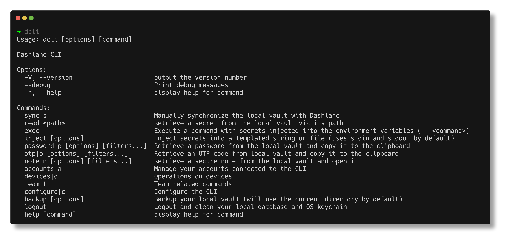

# Dashlane CLI


[
](https://dashlane.github.io/dashlane-cli)



## How to install with homebrew

```sh
brew install dashlane/tap/dashlane-cli
```

## How to install (manually)

Install the dependencies:

```sh
yarn
```

In order to build:

```sh
yarn run build
```

In order to link:

```sh
yarn link
```

In order to bundle for Linux-x64, macOS-x64 and Windows-x64:

```sh
yarn run pkg
```

It outputs in `bundle` directory. Be aware you must use the same Node version as the target.

## How to use (read more in our documentation website)

In order to sync your vault (this is also the recommended first step):

```sh
dcli sync
```

In order to **get a password, secure note or otp**:

```sh
dcli p mywebsite
# will return any entry for which either the url or the title matches mywebsite

dcli p id=xxxxxx
# will return any entry for which the id matches xxxxxx

dcli p url=someurl title=mytitle
# will return any entry for which the url matches someurl, or the title matches mytitle

dcli p url,title=mywebsite
# will return any entry for which either the url or the title matches mywebsite

dcli note title=sample.md
# will return any secure note which matches the filters (similar to password filters)

dcli secret title=api_keys
# will return any secret which matches the filters (similar to password filters)

dcli otp [filters]
# will return any otp which matches the filters (similar to password filters)
```

Note: You can select a different output for passwords among `clipboard, password, json`. The JSON option outputs all the matching credentials.

### Debug mode

You can use `--debug` to see all the debug logs of the CLI.

## How private data is stored on the computer

See [src/modules/crypto/README.md](src/modules/crypto/README.md).

## Contributing

Feel free to contribute to this project, fork and pull request your ideas.
Don't include work that is not open source or not from you.


### How to bump the version

```sh
yarn run version:bump
```

This will change the version of the application with the following rules

- It won't change the major version.
- The minor version will be set to match the following format
  - 2 digits corresponding to the last digit of the current year (ex: 24 for 2024)
  - 2 digits corresponding to the number of the current week (ex: 01 for the first week of the year)
- The patch will be :
  - set to 0 if the minor version has changed
  - incremented from the previous version of the patch otherwise
