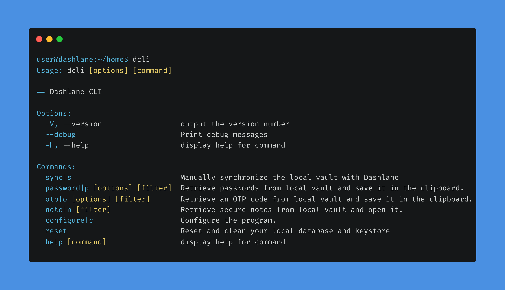

# Experimental Dashlane CLI




## How to install with brew

```sh
brew install --build-from-source dashlane-cli.rb
```

## How to install (manually)

Install the dependencies:

```sh
yarn
```

In order to build:

```sh
yarn run build
```

In order to link:

```sh
yarn link
```

In order to bundle for Linux-x64, macOS-x64 and Windows-x64:

```sh
yarn run pkg
```

It outputs in `bundle` directory. Be aware you must use the same Node version as the target.

## How to use

In order to get help:

```sh
dcli help
```

In order to sync your vault (this is also the recommended first step):

```sh
dcli sync
```

In order to **get a password**:

```sh
dcli p mywebsite
# will return any entry for which either the url or the title matches mywebsite

dcli p id=xxxxxx
# will return any entry for which the id matches xxxxxx

dcli p url=someurl title=mytitle
# will return any entry for which the url matches someurl, or the title matches mytitle

dcli p url,title=mywebsite
# will return any entry for which either the url or the title matches mywebsite
```

Note: You can select a different output for passwords among `clipboard, password, json`. The JSON option outputs all the matching credentials.

In order to **generate an OTP**:

```sh
dcli otp [filters]
```

In order to **get a secure note**:

```sh
dcli note [titleFilter]
```

### Options

You can use `--debug` to see all the debug logs of the CLI.

In order to disable automatic synchronization of your vault that is done every hour you can use
`dcli configure disable-auto-sync true`.

If you don't want to use the OS keychain or if you don't want the CLI to save your master password encrypted you can use
`dcli configure save-master-password false`. If you previously had saved your master password encrypted it will delete
it and also delete the local key from the OS keychain.

## How private data is stored on the computer

See [src/crypto/README.md](src/crypto/README.md).

## Contributing

Feel free to contribute to this project, fork and pull request your ideas.
Don't include work that is not open source or not from you.

**Warranty note**: Dashlane CLI project is provided “as is,” without warranty of any kind, either express or implied. Neither Dashlane, Inc. nor its affiliates, employees or contractors warrant that Dashlane CLI will meet your requirements, operate as required without error or provide future updates. Dashlane, Inc. does not provide customer support on this project. The community is invited to submit bugs and improvements in the issues and pull requests sections of this repository.

## Troubleshooting

### Mismatching signatures

If you are using the CLI in multiple environments, and particularly in an IDE like WebStorm, they may use different
OS keychain environments so the local keys may not match: the reason why signatures are invalid.

To detect this problem you can, on Linux, install secret-tool: `sudo apt install libsecret-tools`, execute
`secret-tool search service dashlane-cli` on every environment and check if the secrets match.

If they don't, you can fix the error by manually editing what is stored in the OS keychain using this command:
`secret-tool store --label "dashlane-cli@<dashlaneId>" service dashlane-cli account <dashlaneId>` in the
failing environment with the secret from the healthy environment.

### RequestError: unable to verify the first certificate

In NodeJS the list of certificate authorities is hardcoded, read more here: [nodejs/node#4175](https://github.com/nodejs/node/issues/4175).
You can use an environment variable to add custom certs ([see documentation](https://nodejs.org/docs/latest-v16.x/api/cli.html#node_extra_ca_certsfile)):

```sh
NODE_EXTRA_CA_CERTS=/<...>/.ssl/extra_certs.pem
```

See the issue [#46](https://github.com/Dashlane/dashlane-cli/issues/46).
