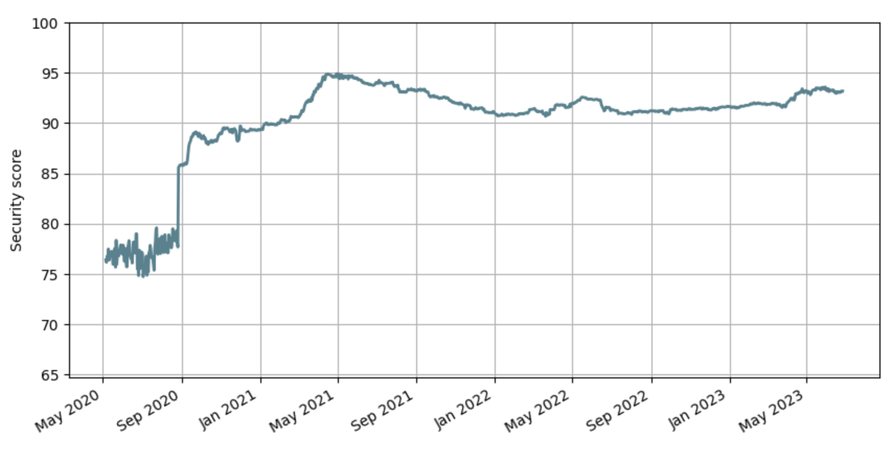

import { Callout } from 'nextra/components';

# Reports

You can get reports on your team about the number of seats provisioned, used and pending. You can also get reports on the aggregated password health history of your team.

<Callout emoji="💡">Needs team credentials to use this command.</Callout>

## Fetch reports

The following commands take in input the number of days to look back for the password health history. The default is 0 day.

```sh copy
dcli t report 30
```

## Generate graphics from reports

One way to consume password health history reports is to generate graphics from them.



The following Python script example will generate a graphic from the report.

```python copy showLineNumbers filename="generate-graph.py"
import matplotlib.pyplot as plt
import numpy as np


def format_month(month: str):
    match month:
        case "01":
            return "Jan"
        case "02":
            return "Feb"
        case "03":
            return "Mar"
        case "04":
            return "Apr"
        case "05":
            return "May"
        case "06":
            return "Jun"
        case "07":
            return "Jui"
        case "08":
            return "Aug"
        case "09":
            return "Sep"
        case "10":
            return "Oct"
        case "11":
            return "Nov"
        case "12":
            return "Dec"


def format_x_label(label: str):
    year, month = label.split("-")
    return f"{format_month(month)} {year}"


def generate_graph(file_path: str, data):
    dates = []
    values = []
    for value in data:
        dates.append(np.datetime64(value["date"]))
        values.append(value["securityIndex"])

    # create two subplots with the shared x and y axes
    fig, (ax) = plt.subplots(figsize=(10, 5))

    ax.plot(dates, values, lw=2, color="#4e828f")
    ax.grid(True)

    ax.set_ylabel("Security score")
    labels = ax.get_xticklabels()
    for label in labels:
        label._text = format_x_label(label._text)
    ax.set_xticklabels(labels)

    ax.set_ylim(min(values) - 10, 100)

    fig.suptitle("Evolution of the team security score")
    fig.autofmt_xdate()

    plt.savefig(file_path)
    plt.close()
    return file_path
```
