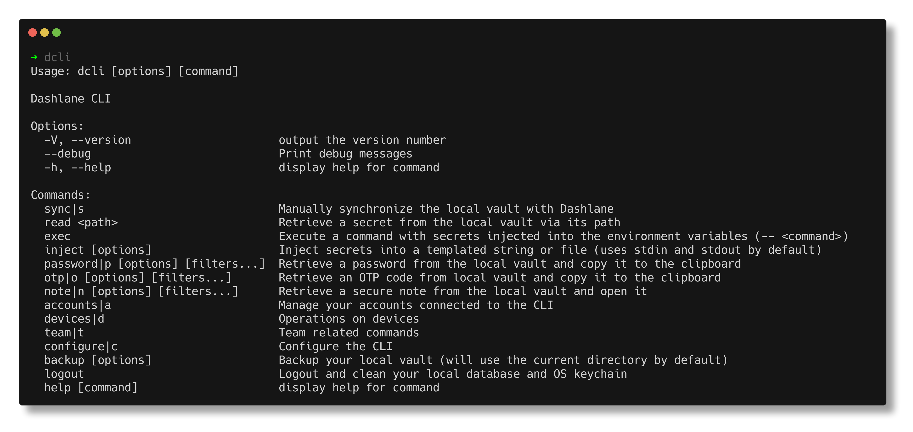

import { Card, Cards } from 'nextra-theme-docs';

# Documentation

<Cards>
    <Card title="⚙️ Setup the CLI" href="/install" />
    <Card title="💬 Discuss with us" href="https://github.com/Dashlane/dashlane-cli/discussions" target="_blank" />
    <Card title="👩‍💻 Contribute on Github" href="https://github.com/Dashlane/dashlane-cli" target="_blank" />
</Cards>

**Dashlane CLI is a command line interface for Dashlane.** It allows you to interact with your Dashlane account, and to manage your passwords, secure notes, secrets and personal data.

Dashlane CLI also allows you to access team admin related features such as accessing your team's member list, Dark Web Insights reports and audit logs.

This documentation is separated in three parts:

<Cards>
    <Card title="👤 Personal Commands" href="/personal" />
    <Card title="👔 Business Commands" href="/business" />
    <Card title="🧩 Integrations" href="/integrations" />
</Cards>
