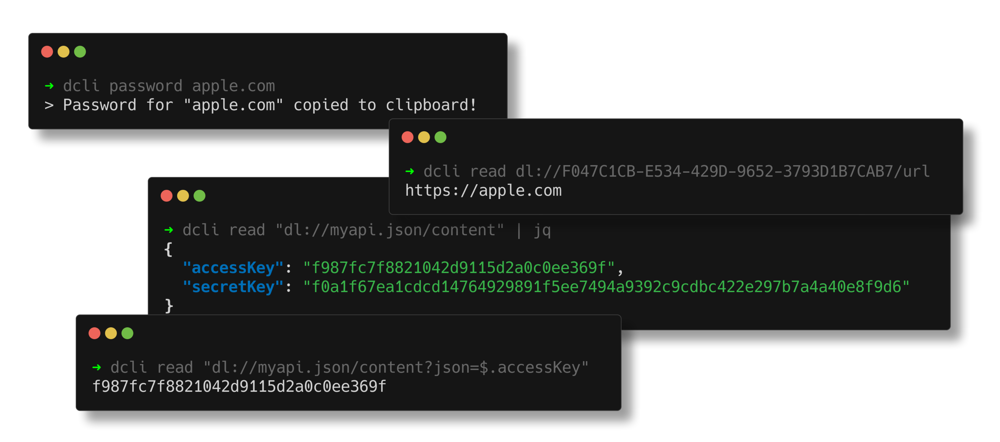

import { Cards } from 'nextra/components';

# Get started with Personal Commands

Accessing your personal vault allows you to view your passwords, secure notes and OTP codes.

<Cards>
    <Cards.Card title="🔑 Authentication" href="/personal/authentication" />
    <Cards.Card title="🔒 Accessing your vault" href="/personal/vault" />
    <Cards.Card title="📱 Manage your devices" href="/personal/devices" />
    <Cards.Card title="🔎 Load your secrets" href="/personal/secrets/read" />
    <Cards.Card title="🛟 Backup your local vault" href="/personal/backup" />
</Cards>
