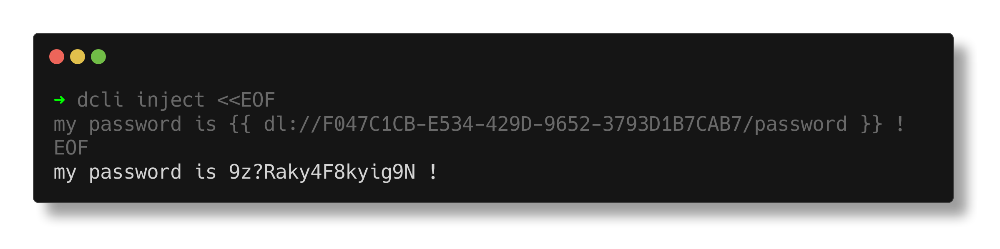

import { Steps, Callout } from 'nextra/components';
import { YoutubePlayer } from '../../../components/player';

# Load secrets into templated files

Using Dashlane CLI you can inject secrets into templated files.
This is useful for example to inject secrets into configuration files and avoid storing secrets in your repository.

<YoutubePlayer videoId="FfjBC8MBAQk" />

<Steps>
### Get your secret reference
 
Follow the guide in [Read secrets references](/personal/secrets/read) to learn how to get your secret reference.

It should look like this: `dl://<secret_identifier>/<field>?<transformer>`

### Use secret references in your config file

In your template config file, use the secret reference as a placeholder for the value you want to inject.

The secret reference must be enclosed in double curly braces `{{ }}`.

For instance, let's create a template config file for a fictive API:

```yaml filename="config.yaml.template"
api:
    url: https://api.example.com
    port: 443
    access_token: '{{ dl://<secret_identifier>/<field> }}'
```

### Inject secrets into your config file

Use the `dcli inject` command to inject secrets into your config file.

```sh filename="Inject secrets into config file" copy
dcli inject --in config.yaml.template --out config.yaml
```

In output file, the secret reference is replaced by the plaintext secret value.



<Callout type="error">Make sure to delete the resolved config file if you no longer need it.</Callout>

</Steps>
