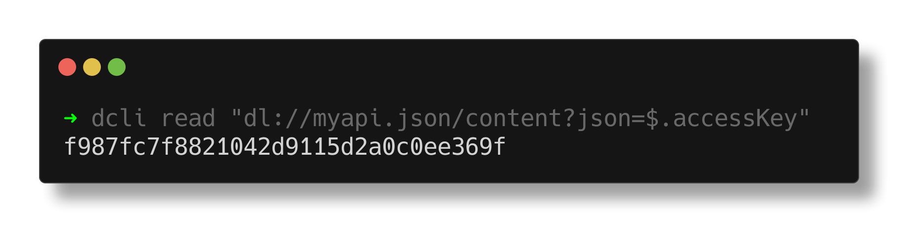
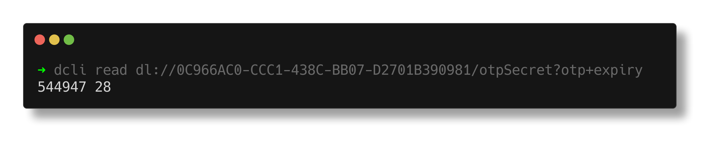

import { YoutubePlayer } from '../../../components/player.tsx';

# Read secrets references

A secret reference is an URI starting by `dl://` that points to a secret stored in your vault.

You can use a secret reference to securely load a secret from your vault into environment variables, scripts or configuration files.

<YoutubePlayer videoId="i1TAKqM5nOg" />

## Structure of secret references

The URI is composed of 4 parts:

1.  The **scheme** `dl://`
1.  The **identifier** of the secret (or its title)
1.  (optionally) the **field** of the secret to load
1.  (optionally) a **transformer** to apply to the secret

```text
dl://<secret_identifier>[/<field>][?<transformer>]
```

### Secret identifier

The secret identifier is the unique identifier of the secret in your vault (it can be either a content type `password`, `secure note` or `secret`).
You can get this identifier by displaying the full json of a secret with the command `dcli password <title> -o json`.

```sh
# You will find them in the "id" field of the json
{
  "creationDatetime": "1691073205",
  "id": "{QD145B53-B987-4CFE-9408-F25803DC47A4}",
  ...
}
```

**Note:** Make sure to remove the `{}` around the identifier before using it in the path. In this example it is `QD145B53-B987-4CFE-9408-F25803DC47A4`.

Alternatively, you can use the title of the secret instead of its identifier. In this case, the secret will be loaded by searching for its title in your vault.
If multiple secrets have the same title, the first one will be loaded.

### Field

The field is the name of the field of the secret to load. If not specified, the whole secret will be loaded in a JSON format.

### Transformer

The transformer is a function that will be applied to the secret field before loading it. It can be used to format the secret in a specific way.

Available transformers:

-   `?otp` to generate a one-time password from a secret key
-   `?otp+expiry` to generate a one-time password from a secret key and display its expiry date (in seconds)
-   `?json=<JSONPathQuery>` to extract a value from a JSON object
    (please refer to [JSONPath documentation](https://github.com/JSONPath-Plus/JSONPath#syntax-through-examples) for more information)



## Read a secret reference

You can simply use the `dcli read <path>` command to read a secret reference.

```sh copy filename="Read the whole secret"
dcli read dl://<secret_identifier>
```

```sh copy filename="Read a specific field of the secret"
dcli read dl://<secret_identifier>/<field>
```

```sh copy filename="Read a specific field of the secret and apply a transformer"
dcli read dl://<secret_identifier>/<field>?<transformer>
```

**Note:** Accessing a secret with the secret identifier is faster than using the title of the secret as it does not require to decrypt the whole vault.


